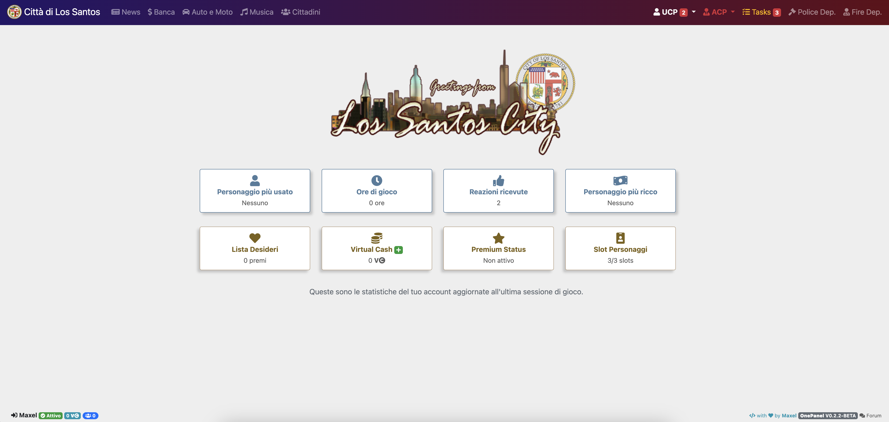

Gran parte dei miei lavori ormai archiviati possono essere visionati online in versione demo in sola lettura.

> **Nota:** Le credenziali di accesso sono già state impostate. Nella pagina di accesso, è sufficiente premere il bottone di accesso per entrare.

### Online Gaming Community

Di seguito sono riportati alcuni dei siti web realizzati per Atlantis Roleplay e LSCity Roleplay.

[OnePanel di LSCity](http://archive.marianosciacco.it/onepanel)
- User Control Panel, Admin Control Panel e pannello Game Manager sviluppato in PHP.

[AtlantisBook v1](http://archive.marianosciacco.it/atlantisbook1)
- Social network sviluppato _from scratch_ in PHP e JS.

[Portale di LSCity.org](http://archive.marianosciacco.it/lscity)
- Portale si Los Santos, City of San Andreas con codice penale dinamico sviluppato in PHP.
    - [Versione 1.0](http://archive.marianosciacco.it/lscity/V1.0) - Prima Release con codice giuridico dinamico
    - [Versione 1.3](http://archive.marianosciacco.it/lscity/V1.3) - Aggiornato per LSCity Roleplay
    - [Versione 1.5](http://archive.marianosciacco.it/lscity/V1.5) - Ultima release

[Portale del LSPD](http://archive.marianosciacco.it/pd_site)
- Portale Los Santos Police Department sviluppato in PHP.

[Database del LSPD](http://archive.marianosciacco.it/pd_desktop)
- Portale per i rapporti di servizio LSPD sviluppato in PHP.

[Database del EMS](http://archive.marianosciacco.it/ems)
- Database per l'Emergency Medical Service sviluppato in PHP.

[Database del LSNN](http://archive.marianosciacco.it/lsnn)
- Database per il Los Santos News Networks sviluppato in PHP.

[Database del LSW](http://archive.marianosciacco.it/lsw)
- Database per il Los Santos Workshop (Officina) sviluppato in PHP.

[Database di Scuola Guida](http://archive.marianosciacco.it/scuolaguida)
- Database per la scuola guida sviluppato in PHP.

### Tool di sviluppo

[Devboard](http://archive.marianosciacco.it/devboard)
- Issue Tracking System con project management realizzato in PHP.

### Siti vetrina

[Sito web personale di iMaxel.net](http://archive.marianosciacco.it/imaxel)
- Sviluppato in HTML, CSS, JS e PHP.
    - [Versione 0](http://archive.marianosciacco.it/imaxel/V0) - Prima Release con sistema Blog integrato
    - [Versione 1](http://archive.marianosciacco.it/imaxel/V1) - Restyle grafico della prima release
    - [Versione 2](http://archive.marianosciacco.it/imaxel/V2) - Riscrittura completa con restyle grafico
    - [Versione 3](http://archive.marianosciacco.it/imaxel/V3) - Restyle grafico, poi migrato a marianosciacco.it

[Skillers Gaming](http://archive.marianosciacco.it/skillers)
- Blog per una community di gioco online sviluppato in PHP.
